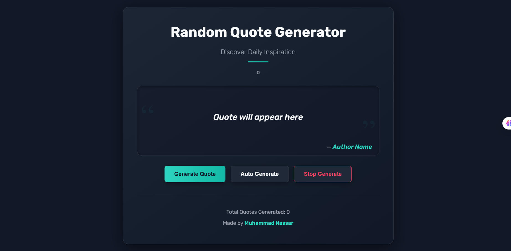

# 📖 Random Quote Generator

A simple web app built with **TypeScript, HTML, and CSS**.  
It displays random quotes from a JSON file with options to generate manually or enable auto-generation.

🔗 **Live Preview:** [quotegenerat0r.netlify.app](https://quotegenerat0r.netlify.app/)  
⏱️ In auto mode, a new quote is generated every **8 seconds**.

---

## 🖼️ Preview

### Manual Quote Generation

### Auto Quote Generation

---

## 📂 Project Structure
All files are included in a single folder:
- `index.html`
- `style.css`
- `script.js` (compiled from `script.ts`)
- `script.ts`
- `quotes.json`
- `favicon.ico`
- Preview images

---

## 🚀 How to Run
Just open **`index.html`** in your browser.
